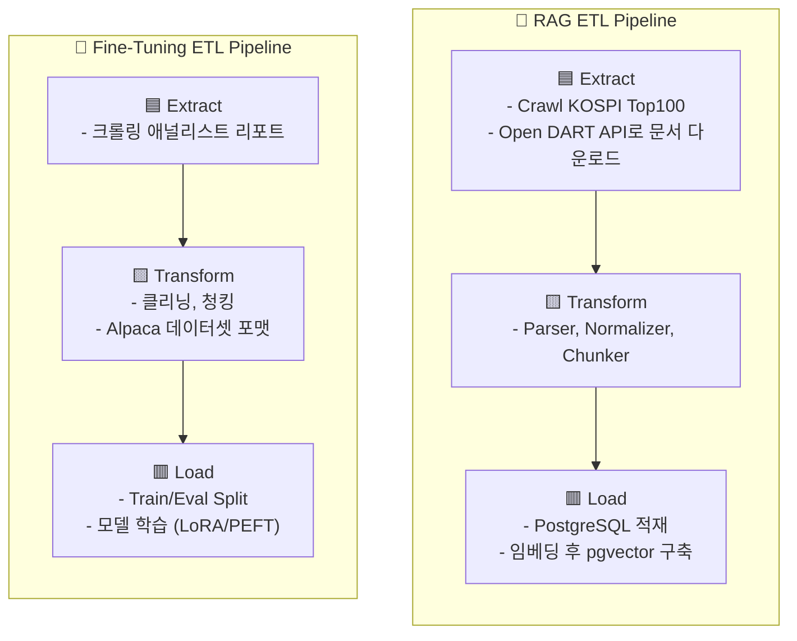
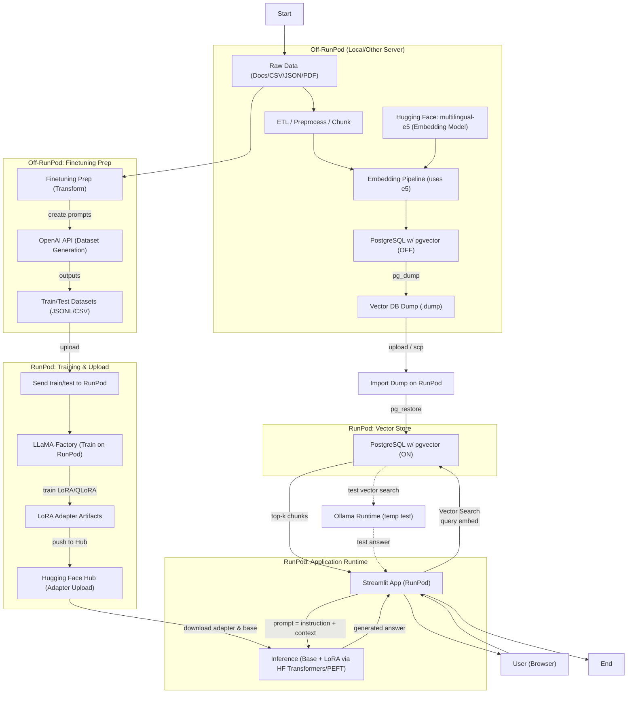
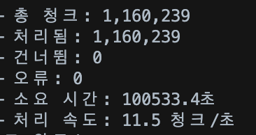

# 💵 공시 문서 및 애널리스트 분석 리포트 기반의 투자 Q&A 시스템

임금-물가 상승률  


임금/부동산/주식 상승률  


적금/ 임금 상승 / 주식시장 상승률  


  2025년 현재 임금 상승률보다 물가 상승률이 더 가파른 상황에서 예적금만으로는 자산 증식이 어려운 상황입니다. 이에 따라 많은 사람들이 자산 증식을 위해 투자에 관심을 보이고 있습니다.

  
  투자는 선택이 아닌 필수가 되었지만, 평소 경제뉴스에 큰 관심을 가지지 않았고 관련 지식이 부족하다면, 특히 주식투자와 같은 경우 두려움과 낯설음에 쉽사리 접근하기가 어렵습니다.

  이런 어려움을 해결하기 위해 저희 팀은 사용자의 수준에 맞춰 원활한 주식 투자가 가능하도록 **공시 문서 및 애널리스트 분석 리포트 기반의 투자 Q&A 시스템**을 만들었습니다.

# 팀
| 이름    | 역할   | 세부 역할 | 
|:------: |:-----: |:-------------------: |
| 황민우  | 팀장   | 문서 ETL, FineTuning  | 
| 김주석  | 팀원   | Prompt Engineering 및 UI | 
| 양진아  | 팀원   | RAG ETL, vectorDB 구축, LangGraph  | 
| 김민주  | 팀원   | UI/UX 기획/개발  | 
| 황혜진  | 팀원   | Data Tool, Fine Tuning, LangGraph | 

# 프로젝트 구조

```text  
├── app.py                 # Streamlit 진입점
├── pages/                 # Streamlit 멀티 페이지 모듈
│   ├── app_bootstrap.py   # 공통 페이지 설정 및 사이드바 메뉴 정의
│   ├── page1.py           # 채팅 Q&A 페이지
│   ├── data_tool.py       # 데이터 도구 페이지
│   └── views/             # 채팅 등 공통 뷰 컴포넌트 (page에서 이용)
│       ├── chat.py        # 채팅 UI 레이아웃
│       ├── {view}.py      #
│       ├── {veiw}.py      #
│       └── ...
├── service/               # LLM등 로직/기능
│   ├── crawling/   # 데이터 크롤링
│   ├── etl/   
│   ├── fine_tuning/    # 데이터 정제 및 llama_factory
│   ├── llm/    # LLM
│   ├── pgv_temp/ 
│   ├── rage/  
│   ├── chat_service.py    # SQLite 기반 채팅 세션 관리
│   └── ...
├── data/                  # 분석·시각화에 사용하는 원천 데이터
│   └── app_database.db    # SQLite 데이터베이스
├── assets/                # 이미지, 아이콘 등 정적 리소스
├── config/                # 환경 설정 파일 (예: YAML, JSON)
├── graph/                 # lang-graph
│   ├── state.py                  # 상태 스키마(QAState)
│   ├── app_graph.py              # 그래프 구성/compile/팩토리 함수
│   ├── nodes/                    # LangGraph 노드들
│   └── utils/
├── models/
│   ├── adapters/                   
│   └── base/
├── requirements.txt       # Python 의존성 목록
├── cleanup_system.py
├── docker-compose.yml
├── migrate_to_sqlite.py
└── README.md
```

# 도구/기술
#### **Environment**  
  
  
  
  
  
#### **Development**  
  
  
  
  
  
  
#### **Database / Infrastructure**  
  
  
  
#### **Communication**  


# 요구사항
### 1️⃣ 데이터 수집 및 전처리
- 금융 공시 API(JSON/XML)에서 주요 지표(매출, 이익 등)를 수집하고, 자연어 문장 형태로 변환해 정제
### 2️⃣ 설계 및 구축
- 사용자의 투자 이해도(초급·중급·고급)에 따른 적응형 문항 트리와 RAG 기반 금융 Q&A 아키텍처를 설계 및 구현
### 3️⃣ ETL
- API 데이터 추출(Extract) → 스키마 정규화(Transform) → 임베딩 벡터 저장(Load) 과정을 자동화 파이프라인으로 구성
### 4️⃣ 모델링 결과 및 시각화
- 사용자 레벨별 응답 차이, 문서 검색 정확도, Q&A 결과를 Streamlit 대시보드로 시각화

# 수집 데이터
- Open Dart : 1년치 코스피 공시 보고서   
  - 사업보고서, 분기보고서, 감사보고서, 주요사항보고서, 자기주식취득보고서  
- 신한 프리미어 리서치 : 애널리스트 리포트 (국내)

# 화면 구성

### 화면설계도
- 

1. **홈 화면**  
   - RAG/LLM 학습현황: 임베딩 문서 수, 평균 응답 정확도, 마지막 학습시간  
   - 사용자의 투자지식 진단을 위한 문제 풀이  
2. **챗봇 화면**  
   - 사용자가 진단받은 투자 레벨(초급, 중급, 고급)에 따라 최적화된 답변 제시   
   - 학습데이터셋에서 예상 질문 리스트를 추출하여 ‘자주 묻는 질문’에 활용  
   - 새 대화창 생성 및 삭제 기능: 주제에 따라 분리된 대화 가능  
3. **데이터도구**  
   ETL 파이프라인 순서에 대한 내용 기재  
   - RAG 구축용 ETL 파이프라인: 처리 모드, 임베딩 모델을 선택 가능  
   - FineTuning용 ETL 파이프라인: 금융리포트 추출 갯수를 직접 선택하여 실행 가능  
   - 실행로그 저장

### 실제화면 


# 설계

1. ## ETL 

- **정의**  : 데이터 품질을 보장하며 시스템 간을 연결하는 정제된 통합 프로세스  
	* **추출(Extract)** : 다양한 **이기종 데이터 소스**로부터 데이터를 추출  
	* **변환(Transform)** : 분석 및 저장 목적에 맞게 변환  
	* **적재(Load)** : Data Warehouse, Data Mart 같은 대상 저장소(Target System)로 적재  
- **목적** :   
	* **데이터 일관성 확보 (Consistency)** → 여러 시스템의 데이터를 통합된 형태로 제공  
	* **데이터 품질 향상 (Quality)** → 결측치, 이상치, 중복 제거 등 데이터 정제 수행  
	* **분석 효율성 제고 (Efficiency)** → BI, ML, LLM, 대시보드 등에서 빠르고 정확한 조회 가능




## 2. 시스템 구성 및 흐름도



# 구현

## 1. Prompt Engineering
- 사용자 레벨에 따른 난이도 구분 : 초급 / 중급 / 고급
	```python
	PROMPT_TEMPLATES = {
	  "beginner": """
	  사용자는 투자 초보자입니다.
	  어려운 용어를 쓰지 말고, 예시를 들어 쉽게 설명하세요.
	  """,
	  "intermediate": """
	  사용자는 기본적인 투자 용어를 알고 있습니다.
	  주요 수치(매출, 이익률 등)는 포함하되 설명은 간결하게 하세요.
	  """,
	  "advanced": """
	  사용자는 재무제표와 투자지표를 이해합니다.
	  구체적인 수치 비교와 추세 해석, 문서 근거를 함께 제시하세요.
	  """
	}
	```
	- 초보자: 쉬운 용어 + 예시
	- 중급자: 핵심 수치 + 짧은 설명
	- 고급자: 구체적 수치 + 추세 해석 + 근거 제시 

- 프롬프트 기본 규칙(핵심))
	- 제공 컨텍스트 밖 추론 금지 
	- 원문에서 근거 제시
	- 투자 권유 금지

- 답변 구조 
	- beginner 레벨이면 ①핵심 요약(쉬운 용어) ②간단 예시 ③근거
	- advanced 레벨이면 ①핵심 결론 ②수치 비교/추세 해석 ③리스크·가정 ④근거
	- 그 외는 ①핵심 요약 ②핵심 수치·포인트 ③근거

## 2. RAG

- **목적** : 금융 공시 문서(사업보고서, 분기보고서, 주요사항보고서, 자기주식취득결정 등)를 자동 수집·처리하여 **자연어 질의에 대한 답변을 제공하는 RAG 시스템 구축**
- **결과**  
  - **데이터 규모**: 5,076 문서 → 1,143,618 청크  
  - **벡터 DB**: PostgreSQL + pgvector  


---

### 전체 파이프라인

#### 1) Retrieval (검색)

| 항목 | 내용 |
|------|------|
| **도구** | `Retriever` (pgvector) |
| **방법** | intfloat/multilingual-e5-small 기반 **벡터 유사도 검색** |
| **옵션** | `TemporalParser` 를 활용한 **시간 필터링 지원** |
| **출력** | top_k = 5 청크 |

---

#### 2) Reranker (재정렬)

| 항목 | 내용 |
|------|------|
| **도구** | `CombinedReranker` |
| **방법** | 키워드 매칭 + **길이 / 위치 기반 점수화** |
| **출력** | 상위 n개 청크 |

---

#### 3) Augmentation (프롬프트 구성)

| 항목 | 내용 |
|------|------|
| **도구** | `DocumentAugmenter` + `Formatters` |
| **포맷** | Prompt / Markdown / JSON |
| **메타데이터 포함** | `corp_name`, `document_name`, `rcept_dt`, `doc_type` |

---

<p align="center">
  
</p>

---

### RAG As a Service — RAGAs 평가

| 메트릭 | 평가 대상 | 질문 |
|--------|----------|------|
| **Faithfulness** | 답변 | 컨텍스트에 근거하는가? |
| **Answer Relevancy** | 답변 | 질문과 관련있는가? |
| **Context Precision** | 검색 | 정확한 문서를 찾았는가? |
| **Context Recall** | 검색 | 필요한 정보를 모두 찾았는가? |

- **도구**: `UnifiedRAGEvaluator`  
- **평가 방식**: 간소화된 키워드 매칭 기반 **자동 스코어링**

<p align="center">
  
</p>

<p align="center">
  
</p>

## 3. FineTuning
- **목적** : 증권사 애널리스트 리포트 요약/코멘트를 이용해서 리스크/밸류에이션/가이던스 해석 포함한 "공시 해석 지능” 학습  
- **데이터 정제** : Crawling, Cleaning, Chunking, Split Train/Eval  
- **도구** : LLaMA Factory  
  - 정의 : **LLM 모델 파인튜닝과 운영**을 코드 몇 줄, 혹은 클릭만으로 진행할 수 있게 돕는 학습·서빙용 **프레임워크**  
  - 참고 : [SK Tech 블로그](https://devocean.sk.com/blog/techBoardDetail.do?ID=166098)  
- **옵션**   
  - Stage: sft  
  - Base Model : meta-llama/Llama-3.2-3B  
  - Finetuning Type : lora   
  - 방식 : qLoRA  
- **결과 및 추론** :   
    
    
    
- **산출물** : https://huggingface.co/has0327/llama3.2-3b-ko-report-lora  
- **참고** : 원본를 배포하면 저작권 위반 -> 원본을 합치지 않고, adapter만 공개하면 합법적이고 안전

4. ## LangGraph
- 핵심 원칙
	- LangGraph에서 각 노드는 “자신이 맡은 일만 정확하게 수행”하는 것이 핵심
	- 단일 책임 원칙: 각 노드는 한 가지 일만
	- 명확한 데이터 흐름: 불필요한 의존성 금지
	- 에러 전파 관리: 실패는 투명하게 처리
- 노드 플로우
    ```mermaid
    flowchart TD
    %% === Styles ===
    classDef oval fill:#e2e8f0,stroke:#94a3b8,color:#000;
    classDef node fill:#f8fafc,stroke:#94a3b8,color:#000;

    %% === Nodes ===
    START([START])
    Router["Router<br/>- set user_level<br/>- meta(top_k/rerank_n/max_ctx_tokens)"]
    QueryRewrite["QueryRewrite<br/>- keyword/time/ticker enrich"]
    Retrieve["Retrieve (pgvector)<br/>- top_k by level<br/>- optional date freshness"]
    Rerank["Rerank (optional)<br/>- cross-encoder/bge reranker<br/>- pick n by level"]
    ContextTrim["ContextTrim<br/>- dedup + token cut<br/>- collect citations"]
    Generate["Generate (FT-LLM)<br/>- System: common + PROMPT_TEMPLATES[level]<br/>- User: question+context+structure<br/>- append [ref: report_id, date]"]
    GroundingCheck["GroundingCheck<br/>- ref present?<br/>- numbers/dates consistent?<br/>- retry if insufficient"]
    Guardrail["Guardrail<br/>- investment disclaimer<br/>- sensitive filter"]
    Answer["Answer<br/>- normalize citations<br/>- return answer+meta"]
    END([END])

    %% === Flow ===
    START --> Router --> QueryRewrite --> Retrieve --> Rerank --> ContextTrim --> Generate --> GroundingCheck --> Guardrail --> Answer --> END

    %% === Retry Path ===
    GroundingCheck -. "retry (≤1x)" .-> Retrieve

    %% === Class Assignments ===
    class START,END oval
    class Router,QueryRewrite,Retrieve,Rerank,ContextTrim,Generate,GroundingCheck,Guardrail,Answer node
    ```
    | 노드                      | 설명                                      |
    | ----------------------- | ------------------------------------------ |
    | **START**               | 사용자의 질문과 투자 레벨 정보를 받아 파이프라인 시작       |
    | **Router**              | 사용자 레벨에 따라 검색 개수, 컨텍스트 길이, 답변 깊이 설정 |
    | **QueryRewrite**        | 질문을 분석해 시점·티커·키워드를 보강해 검색 효율 증가      |
    | **Retrieve (pgvector)** | 리포트 데이터베이스에서 의미상 유사한 문단을 top-k로 검색   |
    | **Rerank**              | 검색된 문단 중 질문과 가장 밀접한 내용을 상위로 재정렬      |
    | **ContextTrim**         | 중복 문장을 제거하고, 최대 토큰 길이 내로 컨텍스트를 정리    |
    | **Generate (FT-LLM)**   | 파인튜닝된 모델이 레벨별 프롬프트에 맞춰 답변을 생성        |
    | **GroundingCheck**      | 답변이 실제 문서 근거와 일치하는지, ref가 포함됐는지 검증   |
    | **Guardrail**           | 투자 권유나 민감 표현을 필터링하고 안내 문구를 자동 추가     |
    | **Answer**              | 중복 인용을 정리하고 근거 문단과 함께 최종 답변을 반환      |
    | **END**                 | 사용자에게 레벨별 맞춤형 근거 기반 답변이 전달          |


# 인사이트
### 1️⃣ 정형 데이터와 비정형 텍스트의 경계 허물기
- 금융 데이터는 대부분 수치(json, xml, 테이블)로 제공되지만, 이를 문장으로 재구성하면 LLM이 문맥·인과를 이해할 수 있게 된다.
- 즉, 정량데이터 → 자연어 문서화 → 임베딩 과정이 RAG의 핵심 전처리 파이프라인
### 2️⃣ RAG 구조가 금융 분석 자동화의 실마리
- 벡터 검색 기반으로 공시문서, 애널리스트 분석 리포트까지 통합 검색하면 모델이 직접 리서치 문서처럼 분석·요약할 수 있다.
- 금융 데이터의 “출처·근거”를 함께 제시함으로써 신뢰성 있는 AI 응답 구조를 구현할 수 있었다.
### 3️⃣ LLM은 ‘수치 계산기’가 아니라 ‘맥락 해석기’
- 재무 수치를 계산하는 건 전통 ML/통계가 강하지만, “이익률 하락의 원인”이나 “사업 구조 변화의 해석”은 LLM이 더 뛰어날 수 있다.
- 즉, ML은 예측 / LLM은 해석, 두 축의 역할 분리가 명확해진다.
### 4️⃣ 질문 이해력(Quality of Query)이 결과 품질을 결정한다
- 같은 문서라도 “매출액 알려줘” vs “매출 성장률 추세 요약해줘”는 완전히 다른 검색/생성 경로를 탄다.
- 질의의 **의도(Intent)·속성(Attribute)·단위(Period)**를 파악하는 질의 분류 모델이 필수적임을 깨달았다.
### 5️⃣ Adaptive Prompt가 사용자 신뢰도를 높인다
- 초보자에겐 설명 위주, 전문가에겐 수치와 근거 중심으로 응답을 조정하면, 같은 LLM이라도 **전문가처럼 느껴지는 맞춤형 리서치 어시스턴트**가 된다.
### 6️⃣ RAG + Domain Schema가 금융 분야 정확도의 핵심
- 임베딩만으로는 ‘매출’과 ‘영업이익’ 구분이 불명확하므로, 메타데이터 스키마(회사명, 분기, 지표명) 필터링이 도메인 정확도를 결정짓는다.
 
# 이슈
- https://github.com/SKNETWORKS-FAMILY-AICAMP/SKN18-3rd-5Team/issues?q=is%3Aissue%20state%3Aclosed

# 느낀점
- 황민우: 프로젝트를 시작하기 전에 깃 사용방법에 대해 팀원들끼리 규칙을 정하고 프로젝트를 진행하는 것이 얼마나 효율적인지 알 수 있었습니다. 크롤링을 통해 얻은 데이터를 정제하고 파인튜닝을 진행하면서 정확한 코드를 작성하는 것도 중요하지만 그것을 뒷받침해줄 하드웨어의 중요성을 다시 한 번 느낄 수 있었습니다.
- 김주석: LLM은 제가 가장 배우고 싶은 기술이면서도 가장 어려운 기술인 거 같습니다. 그래도 이번 프로젝트를 통해서 LLM을 어떻게 사용하는지를 알 수있게 되었고 나머지 부족한 부분은 책을 통해서 혹은 직접 실습해서 채워나가겠습니다! 또 이번 프로젝트를 통해서 개발업무는  업무  분담과 소통의 중요성을  몸소 배울 수 있어서 아주 뜻 깊었습니다!  
- 김민주: 팀원들 간의 업무 분담과 소통이 원활하게 이루어져서  프로젝트가 훨씬 효율적으로 진행될 수 있었던 것 같아요. 모두가 잘 이끌어주신 덕분에 더 열심히 참여하고자 노력했고, 그래서 더 배워갈 수 있었습니다 !!!
- 양진아 : 높은 데이터 품질이 좋은 결과를 만들어낸다. 데이터 정규화의 소중함. 그러나 너무나도 힘들고 귀찮다….또한 설계의 중요성을 느꼈다. 
- 황혜진: GPU 자원의 중요성을 절실히 느꼈다. 작은 모델 하나 학습시키는 일도 CPU 환경에서는 버거웠고, 그 과정을 통해 연산 효율과 인프라 설계가 AI 개발의 핵심임을 깨달았다.

# 하고 싶은 말
- 맥북 에어가 옳다 (by JINA)



