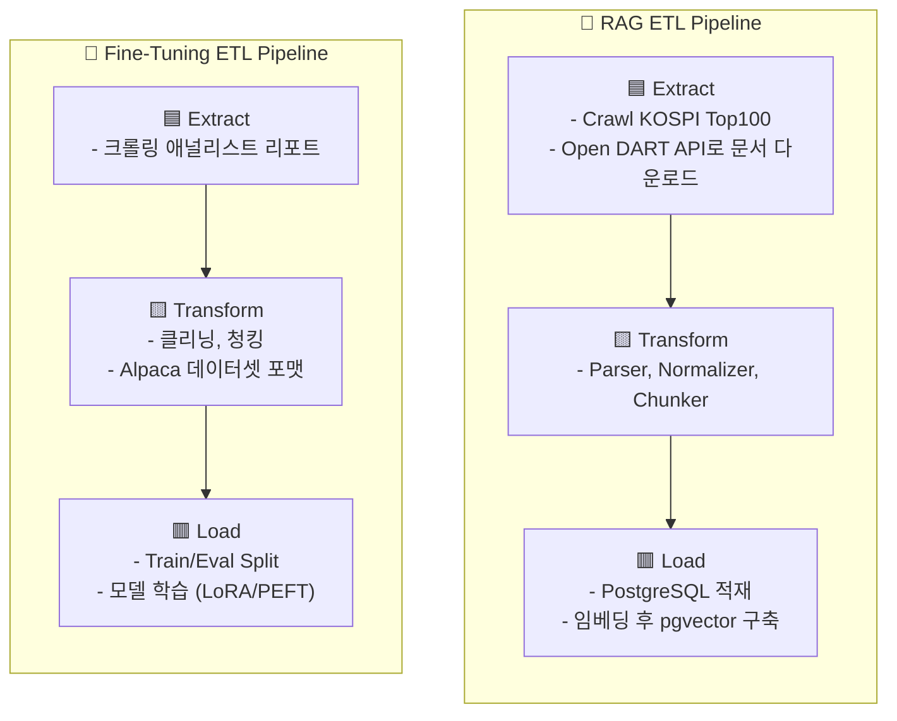
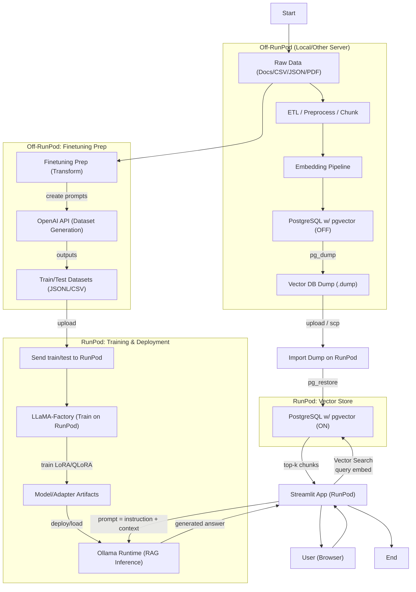

# 주제

임금-물가 상승률  


임금/부동산/주식 상승률  


적금/ 임금 상승 / 주식시장 상승률  


  2025년 현재 임금 상승률보다 물가 상승률이 더 가파른 상황에서 예적금만으로는 자산 증식이 어려운 상황입니다. 이에 따라 많은 사람들이 자산 증식을 위해 투자에 관심을 보이고 있습니다.

  투자는 선택이 아닌 필수가 되었지만, 평소 경제뉴스에 큰 관심을 가지지 않았고 관련 지식이 부족하다면, 특히 주식투자와 같은 경우 두려움과 낯설음에 쉽사리 접근하기가 어렵습니다.  


  이런 어려움을 해결하기 위해 저희 팀은 사용자의 수준에 맞춰 원활한 주식 투자가 가능하도록 **‘공시 문서 및 애널리스트 분석 리포트 기반의 투자 Q&A 시스템’**을 만들었습니다.

# 팀

# 프로젝트 구조

```text  
├── app.py                 # Streamlit 진입점  
├── pages/                 # Streamlit 멀티 페이지 모듈  
│   ├── app_bootstrap.py   # 공통 페이지 설정 및 사이드바 메뉴 정의  
│   ├── page1.py           # 채팅 Q&A 페이지  
│   ├── data_tool.py       # 데이터 도구 페이지  
│   └── views/             # 채팅 등 공통 뷰 컴포넌트 (page에서 이용)  
│       ├── chat.py        # 채팅 UI 레이아웃  
│       ├── {view}.py      #  
│       ├── {veiw}.py      #  
│       └── ...  
├── service/               # LLM등 로직/기능  
│   ├── chat_service.py    # SQLite 기반 채팅 세션 관리  
│   └── ...  
├── data/                  # 분석·시각화에 사용하는 원천 데이터  
│   └── app_database.db    # SQLite 데이터베이스  
├── assets/                # 이미지, 아이콘 등 정적 리소스  
├── config/                # 환경 설정 파일 (예: YAML, JSON)  
├── graph/                 # lang-graph  
│   ├── state.py                  # 상태 스키마(QAState)  
│   ├── app_graph.py              # 그래프 구성/compile/팩토리 함수  
│   ├── nodes/                    # LangGraph 노드들  
│   └── utils/  
├── models/  
│   ├── adapters/                     
│   └── base/  
├── requirements.txt       # Python 의존성 목록  
├── cleanup_system.p       # Python 의존성 목록  
├── requirements.txt       # Python 의존성 목록  
├── requirements.txt       # Python 의존성 목록  
└── README.md  
```

# 도구/기술

- python, streamlit  
- sqllite3  
- postgreSQL, pgvector  
- docker  
- llama factory  
- ollama  
- runpod  
- Hugging Face  
- 또 뭐 있죠…?

# 요구사항

# 수집 데이터

- Open Dart : 1년치 코스피 공시 보고서   
  - 사업보고서, 분기보고서, 감사보고서, 주요사항보고서, 자기주식취득보고서  
- 신한 프리미어 리서치 : 애널리스트 리포트 - 국내  
  - 

# 화면 구성

(화면설계도)

- 

1. **홈 화면**  
   - RAG/LLM 학습현황: 임베딩 문서 수, 평균 응답 정확도, 마지막 학습시간  
   - 사용자의 투자지식 진단을 위한 문제 풀이  
2. **챗봇 화면**  
   - 사용자가 진단받은 투자 레벨(초급, 중급, 고급)에 따라 최적화된 답변 제시   
   - 학습데이터셋에서 예상 질문 리스트를 추출하여 ‘자주 묻는 질문’에 활용  
   - 새 대화창 생성 및 삭제 기능: 주제에 따라 분리된 대화 가능  
3. **데이터도구**  
   ETL 파이프라인 순서에 대한 내용 기재  
   - RAG 구축용 ETL 파이프라인: 처리 모드, 임베딩 모델을 선택 가능  
   - FineTuning용 ETL 파이프라인: 금융리포트 추출 갯수를 직접 선택하여 실행 가능  
   - 실행로그 저장

(실제화면)  


# 설계

1. ## ETL 

- **정의**  : 데이터 품질을 보장하며 시스템 간을 연결하는 정제된 통합 프로세스  
* **추출(Extract)** : 다양한 **이기종 데이터 소스**로부터 데이터를 추출  
* **변환(Transform)** : 분석 및 저장 목적에 맞게 변환  
* **적재(Load)** : Data Warehouse, Data Mart 같은 대상 저장소(Target System)로 적재  
- **목적** :   
* **데이터 일관성 확보 (Consistency)** → 여러 시스템의 데이터를 통합된 형태로 제공  
* **데이터 품질 향상 (Quality)** → 결측치, 이상치, 중복 제거 등 데이터 정제 수행  
* **분석 효율성 제고 (Efficiency)** → BI, ML, LLM, 대시보드 등에서 빠르고 정확한 조회 가능




2. ## 시스템 구성 및 흐름도




# 

# 구현

1. ## Prompt Engineering

     
- 사용자 레벨에 따른 난이도 구분 : 초급 / 중급 / 고급  
    
1. Prompt_Templates   
   PROMPT_TEMPLATES = {  
     "beginner": """  
     사용자는 투자 초보자입니다.  
     어려운 용어를 쓰지 말고, 예시를 들어 쉽게 설명하세요.  
     """,  
     "intermediate": """  
     사용자는 기본적인 투자 용어를 알고 있습니다.  
     주요 수치(매출, 이익률 등)는 포함하되 설명은 간결하게 하세요.  
     """,  
     "advanced": """  
     사용자는 재무제표와 투자지표를 이해합니다.  
     구체적인 수치 비교와 추세 해석, 문서 근거를 함께 제시하세요.  
     """  
   }

     —-----------------------------------  
	초보자: 쉬운 용어 + 예시  
	중급자: 핵심 수치 + 짧은 설명  
	고급자: 구체적 수치 + 추세 해석 + 근거 제시 

- 프롬프트 설정 


	def build_system_prompt(level: str) -> str:  
    base = (  
      "너는 금융 리서치 Q&A 보조원이다. 제공 컨텍스트 밖 추론 금지.n"  
      "수치·날짜는 원문 근거로 정확히 재현하라.n"  
      "반드시 답변 끝에 [ref: report_id, date]를 포함하고 필요 시 URL도 제시하라.n"  
      "이 답변은 정보 제공 목적이며 투자 권유가 아니다.n"  
    )  
    return base + "n" + PROMPT_TEMPLATES.get(level, PROMPT_TEMPLATES["beginner"])  
—------------------------------  
	프롬프트 기본 규칙(핵심)

- 제공 컨텍스트 밖 추론 금지   
- 원문에서 근거 제시  
- 투자 권유 금지!!!

- 답변 구조 

	def build_user_prompt(question: str, context: str, level: str) -> str:  
    if level == "beginner":  
        structure = "①핵심 요약(쉬운 용어) ②간단 예시 ③근거"  
    elif level == "advanced":  
        structure = "①핵심 결론 ②수치 비교/추세 해석 ③리스크·가정 ④근거"  
    else:  
        structure = "①핵심 요약 ②핵심 수치·포인트 ③근거"  
    return f"질문: {question}nn[컨텍스트]n{context}nn요구 형식: {structure}"  
—------------------------------  
	beginner 레벨이면 ①핵심 요약(쉬운 용어) ②간단 예시 ③근거  
	advanced 레벨이면 ①핵심 결론 ②수치 비교/추세 해석 ③리스크·가정 ④근거  
	그 외는 ①핵심 요약 ②핵심 수치·포인트 ③근거

2. ## RAG

- **목적** : pgvector  
- **도구** :    
- **옵션 :** ETL, Retriever, Rerank, Augument,   
- **결과 :**   
  - [ 5,076 문서, 1,143,618청크 ] 문서 데이터 적재  
  - 

  ## **ETL**  

-   
    
  **## **RAG Pipeline****  
    
  **—**  
  **##**RAGAs****   
  

3. ## FineTuning

- **목적** : 증권사 애널리스트 리포트 요약/코멘트를 이용해서 리스크/밸류에이션/가이던스 해석 포함한 "공시 해석 지능” 학습  
- **데이터 정제** : Crawling, Cleaning, Chunking, Split Train/Eval  
- **도구** : LLaMA Factory  
  - 정의 : **LLM 모델 파인튜닝과 운영**을 코드 몇 줄, 혹은 클릭만으로 진행할 수 있게 돕는 학습·서빙용 **프레임워크**  
  - 참고 : [SK Tech 블로그](https://devocean.sk.com/blog/techBoardDetail.do?ID=166098)  
- **옵션**   
  - Stage: sft  
  - Base Model : meta-llama/Llama-3.2-3B  
  - Finetuning Type : lora   
  - 방식 : qLoRA  
- **결과 및 추론** :   
    
    
    
- **산출물** : https://huggingface.co/has0327/llama3.2-3b-ko-report-lora  
- **참고** : 

4. ## LangGraph

-   
    
-   
    
- 

# 인사이트

# 이슈

- streamlit 동기 처리  
- 인프라   
- 그 외 이슈 관리  
  - https://github.com/SKNETWORKS-FAMILY-AICAMP/SKN18-3rd-5Team/issues

# 

# 느낀점

- 황민우: 프로젝트를 시작하기 전에 깃 사용방법에 대해 팀원들끼리 규칙을 정하고 프로젝트를 진행하는 것이 얼마나 효율적인지 알 수 있었습니다. 크롤링을 통해 얻은 데이터를 정제하고 파인튜닝을 진행하면서 정확한 코드를 작성하는 것도 중요하지만 그것을 뒷받침해줄 하드웨어의 중요성을 다시 한 번 느낄 수 있었습니다.  
- 김주석: LLM은 제가 가장 배우고 싶은 기술이면서도 가장 어려운 기술인 거 같습니다. 그래도 이번 프로젝트를 통해서 LLM을 어떻게 사용하는지를 알 수있게 되었고 나머지 부족한 부분은 책을 통해서 혹은 직접 실습해서 채워나가겠습니다! 또 이번 프로젝트를 통해서 개발업무는  업무  분담과 소통의 중요성을  몸소 배울 수 있어서 아주 뜻 깊었습니다!    
- 김민주: 팀원들 간의 업무 분담과 소통이 원활하게 이루어져서  프로젝트가 훨씬 효율적으로 진행될 수 있었던 것 같아요. 모두가 잘 이끌어주신 덕분에 더 열심히 참여하고자 노력했고, 그래서 더 배워갈 수 있었습니다 !!!  
- 양진아 : 높은 데이터 품질이 좋은 결과를 만들어낸다. 데이터 정규화의 소중함. 그러나 너무나도 힘들고 귀찮다….또한 설계의 중요성을 느낌  
-   
- 

---
# 참고 

## 프로젝트 구조

```text
├── app.py                 # Streamlit 진입점
├── pages/                 # Streamlit 멀티 페이지 모듈
│   ├── app_bootstrap.py   # 공통 페이지 설정 및 사이드바 메뉴 정의
│   ├── page1.py           # 채팅 Q&A 페이지
│   ├── data_tool.py       # 데이터 도구 페이지
│   └── views/             # 채팅 등 공통 뷰 컴포넌트 (page에서 이용)
│       ├── chat.py        # 채팅 UI 레이아웃
│       ├── {view}.py      #
│       ├── {veiw}.py      #
│       └── ...
├── service/               # LLM등 로직/기능
│   ├── chat_service.py    # SQLite 기반 채팅 세션 관리
│   └── ...
├── data/                  # 분석·시각화에 사용하는 원천 데이터
│   └── app_database.db    # SQLite 데이터베이스
├── assets/                # 이미지, 아이콘 등 정적 리소스
├── config/                # 환경 설정 파일 (예: YAML, JSON)
├── graph/                 # lang-graph
│   ├── state.py                  # 상태 스키마(QAState)
│   ├── app_graph.py              # 그래프 구성/compile/팩토리 함수
│   ├── nodes/                    # LangGraph 노드들
│   └── utils/
├── requirements.txt       # Python 의존성 목록
└── README.md
```

### 실행 방법
- GPU 필수
- HuggingFace에서 모델 미리 다운로드 실행

```bash
uv pip install -r requirements.txt
playwright install
python service/llm/setup_download.py
streamlit run app.py
```

